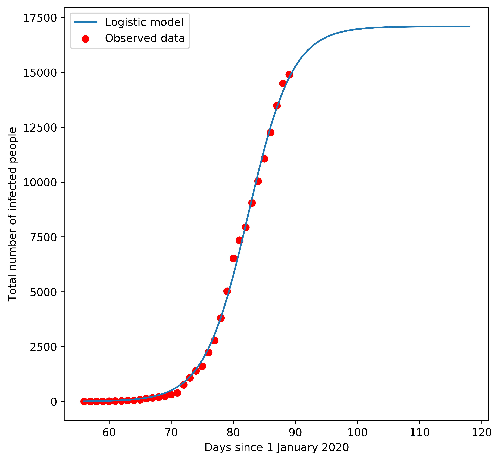

  <h1>Logistic model covid-19 cases in Switzerland</h1>
  

## Model

The logistic model can be used to describe the growth of the infected population. 

## Data 

Using the data from https://github.com/daenuprobst/covid19-cases-switzerland. 